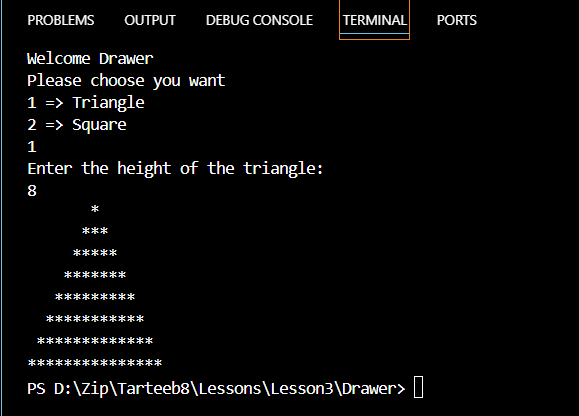
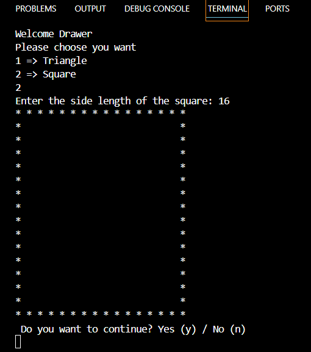

>
> # Drawer
>
## 

- ### Unda ishlatildi
    - Switch(case) method
    - ToLower method
    - DrawerTriangle
    - DrawerSquare

### Input
```bash
Console.WriteLine("Welcome Drawer\nPlease choose you want");
Console.WriteLine("1 => Triangle\n2 => Square");
int numberChoose = Convert.ToInt32(Console.ReadLine());
```
### switch
```bash
switch(numberChoose){
    case 1:DrawerTriangle();
        break;
    case 2: DrawerSquare();
        break;
    
}
```

### Dasturdan qayta foydalanishni so'rash
Foydalanuvchi ___**yes (y)**___ yokida ___**no (n)**___ kiritadi dastur uni kichiklikga o'giradi va __if__ Methodida tekshiradi va __while__ methodni qayta ishlashi yoki to'xtashini belgilaydi 

```bash
Console.WriteLine(" Do you want to continue? Yes (y) / No (n)");
string text = Console.ReadLine().ToLower();
if(text == "Yes" || text == "y"){
    isSuccess = true;
}
else{
    isSuccess = false;
}
```

### MethodTriangle
Bunda dastur foydalanuvchidan **Uchburchak** balandligini qiymatini butun son (___int___) da so'raydi
```bash
static void DrawerTriangle()
{
    Console.WriteLine("Enter the height of the triangle: ");
    int height = Convert.ToInt32(Console.ReadLine());

    for(int i = 1;i<=height;i++){

        for(int j = 1; j<= height - i; j++){
            Console.Write(" ");
        }

        for(int k = 1;k<= (2*i-1); k++){
            Console.Write("*");
        }
        Console.WriteLine("");
    }
}
```
MethodTriangle
Result:


### MethodSquare
Bunda dastur foydalanuvchidan **Square** ning kenglini butun son (___int___) da so'raydi
```bash
    static void DrawerSquare(){
    
    Console.Write("Enter the side length of the square: ");
    int side = Convert.ToInt32(Console.ReadLine());
    
    for(int i = 0; i< side;i++)
    {
        for(int j = 0; j< side; j++)
        {
            // ushbu qism chekkalarini * bilan chiqarish uchun

            if(i == 0 || i == side - 1 || j == 0 || j == side - 1){
                Console.Write("* ");
            }
            // ushbu qism o'rtalarini bo'sh holda chiqarish uchun
            else{
                Console.Write("  ");
            }
        }
        Console.WriteLine();
    }
}

```
## MethodSquare Result

